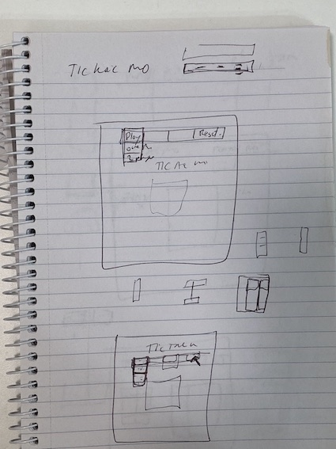
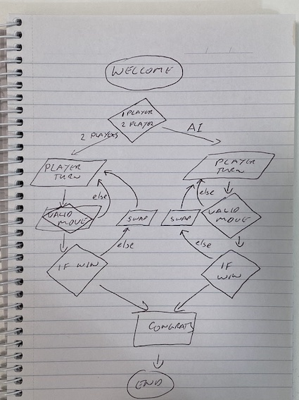

#  Tic Tac Mo

This is the first project for the General Assembly, Software Engineering Imersive course (Seir42). Combining what we've learned to date using HTML, CSS and Javascript. 

Here's a link to the game: https://simmosa.github.io/ticTacMo/

This is a no frills version of classic Tic Tac Toe. Future verions may include:
    - variable board size.
    - one player mode, selecting the difficulty level of the Ai.
    - day and night mode.
    - ability for each player to select an avatar.
    - 2 players over the internet.

The code was designed with scalabilty in mind. The game board is an array of cell objects. It's an over kill for this version but had time permitted, I'd like to implement a smart cell version, where each cell knows:
    - it's position on the board.
    - what it's neighbouring cells are.
    - the likelyhood of being involved in a win scenario.

Visual design of UI is an area I need to spend more time on.. I apear to have a technical aproach but lack some visual creativity. Here' a sketch of early ideas:

.jpeg)

Below is a flow chart that helped in the intial planning of the project.

This has been a great project to help understand the dom. Interacting with the DOM is a intergral part of the project..

A link to the live game can be found here... Enjoy.. https://simmosa.github.io/ticTacMo/